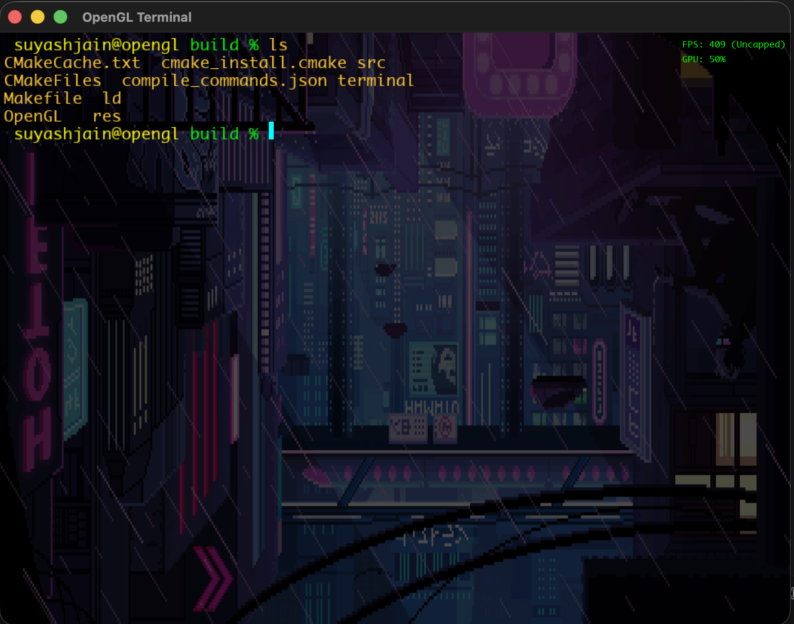

#  TerminalGL: The High-Performance GPU Terminal

> **"Why render text when you can accelerate it?"**

TerminalGL is a custom-built, hardware-accelerated terminal emulator written in **C++** and **OpenGL**. It ditches legacy software rendering for raw GPU power, delivering silky smooth 120+ FPS, vibrant visuals, and a retro-futuristic aesthetic.

Powered by a custom **Batch Rendering Engine** and **Dynamic Texture Atlasing**, it handles thousands of characters with negligible CPU usage. It's not just a terminal; it's a graphical experience.



---

##  Features

###  **GPU-Accelerated Core**
- **Batch Rendering**: Draws the entire screen in < 5 draw calls.
- **Texture Atlas**: Dynamic font packing on a 1024x1024 GPU texture.
- **Zero Latency**: Input processing happens at the speed of light (or roughly 16ms).

###  **Visuals & Aesthetics**
- **Animated GIF Backgrounds**: Support for dynamic, looping backgrounds (via `stb_image`).
- **Retro-Modern Look**: Gold text on Cyan cursors.
- **Uncapped FPS**: Push your GPU to the limit (Toggle VSync with `F3`).

###  **Power User Tools**
- **Shell Integration**: Seamless Zsh/Bash PTY spawning.
- **Smart Zooming**: `Cmd +` / `Cmd -` to scale text instantly.
- **Clipboard Sync**: `Cmd+C` / `Cmd+V` native system integration.
- **Unicode Support**: UTF-8 decoding for multilingual capability.

---

## ⌨️ Controls

| Shortcut | Action |
|----------|--------|
| `Cmd +` / `Cmd -` | Zoom In / Out |
| `Cmd + V` | Paste from Clipboard |
| `Cmd + C` | Copy Selection |
| `Shift + PgUp/Dn` | Scroll History |
| `F3` | Toggle VSync / FPS Cap |
| `Mouse Drag` | Select Text |

---

##  Building from Source

### Dependencies
- **CMake**
- **GLFW**
- **FreeType**

### MacOS (Homebrew)
```bash
brew install cmake glfw freetype
```

### Build & Run
```bash
mkdir build
cd build
cmake ..
make
./terminal
```

---

##  Technical Deep Dive

### The Rendering Pipeline
Most terminals render text as individual bitmaps. TerminalGL approaches text like a game engine:
1.  **Glyph Loading**: FreeType loads vector fonts.
2.  **Atlas Packing**: Glyphs are packed into a single generic `GL_RED` texture on demand.
3.  **Vertex Buffering**: Quads are generated for every character and stored in a dynamic `VBO`.
4.  **Batch Draw**: `glDrawArrays` renders 10,000+ characters in a single GPU command.

### Architecture
- `Terminal.cpp`: State machine handling ANSI escape codes and buffer management.
- `Renderer.cpp`: OpenGL abstraction layer for batching and shader control.
- `PTYHandler.cpp`: Low-level POSIX pseudo-terminal communication.

---

##  Future Roadmap
- [ ] Shader Effects (Bloom, CRT Scanlines)
- [ ] Ligature Support
- [ ] Configuration File (`json`/`toml`)

---

* standard C++17 and OpenGL 3.3.*
